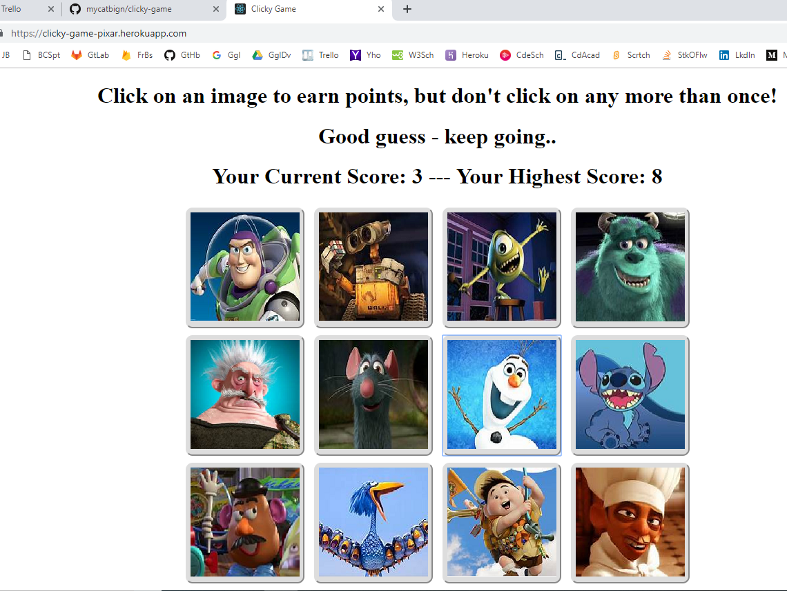

# clicky-game

## Description
Clicky is a simple react app memory game. The clicky-game displays pixar characters as tiles. The goal of the game is to click each tile only once and click all of them. The trick - after each click the board will be shuffled making your challenge a bit more difficult. 

"Clicky Game - Pixar Edition"

## Demo
You can demo the clicky-game [here](https://clicky-game-pixar.herokuapp.com/).

## Additional Tasks/Ideas
- [ ] Time each game.
- [ ] Keep score by user?